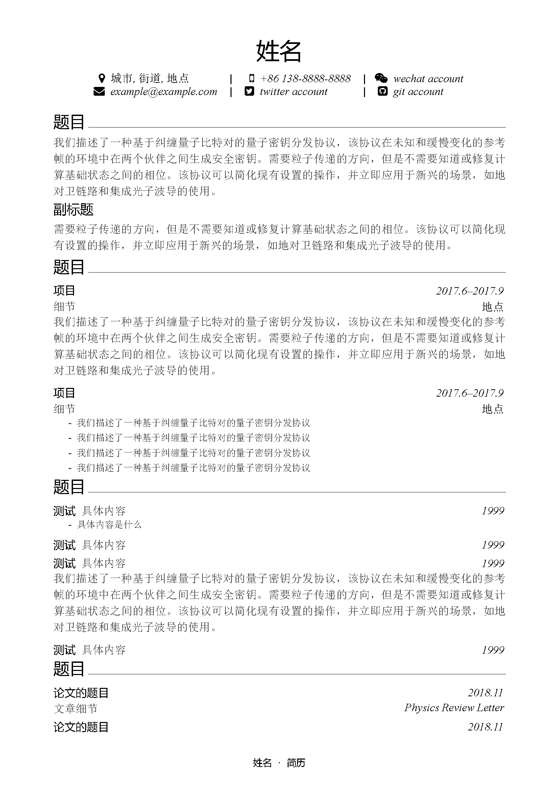
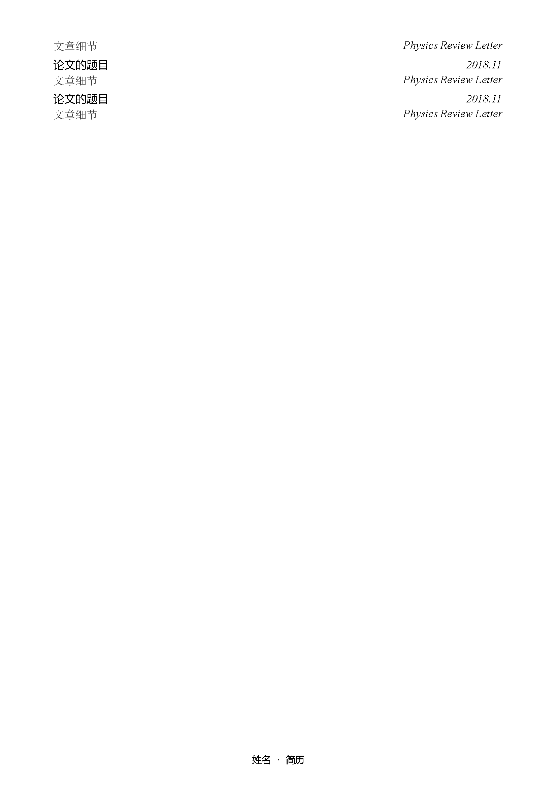
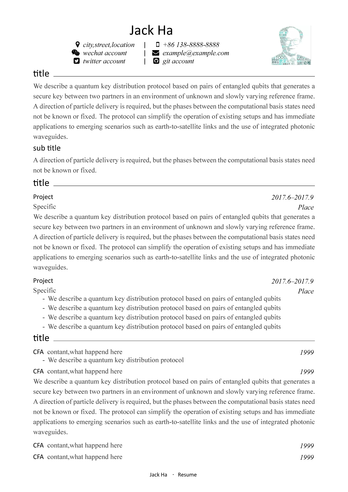
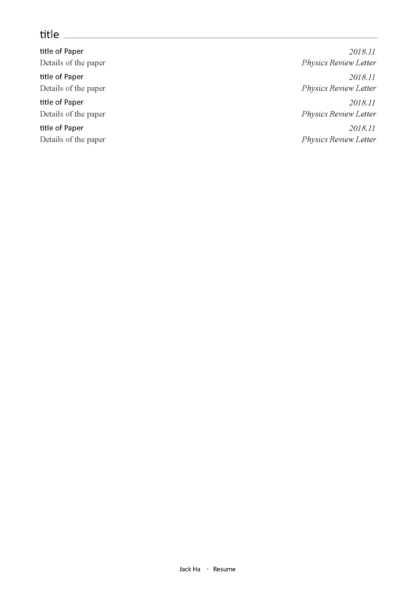

# 极简风格设计中英文简历模板(a resume Class File in two language with minimalist design)

- 作者(auther)：杨舜禹(Shunyu Yang)
- 邮箱(email) ：shunyu.1994@gmail.com
- 可选照片/中英文(Language/photo available - for selection)
- 初次设计(first Updated)：2018.11.1
- 更新时间(Updated)：2018.11.8

## 基本设定

中文字体：宋体 微软雅黑

English font：Times New Roman Calibri

页面边距：left=2.0cm, top=1.5cm, right=2.0cm, bottom=2.0cm

# 示例

## 中文实例

## 英文实例

